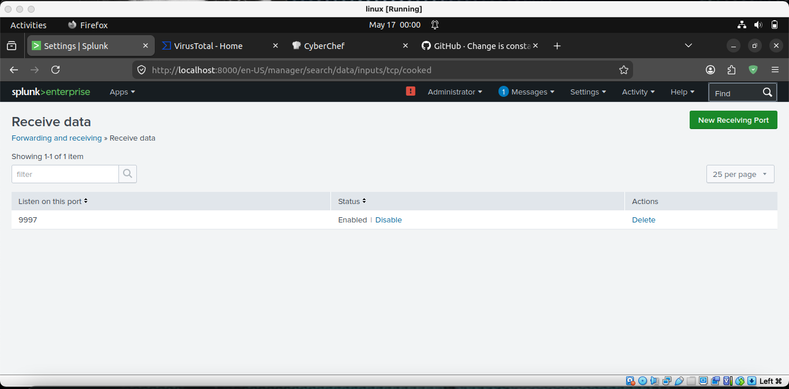
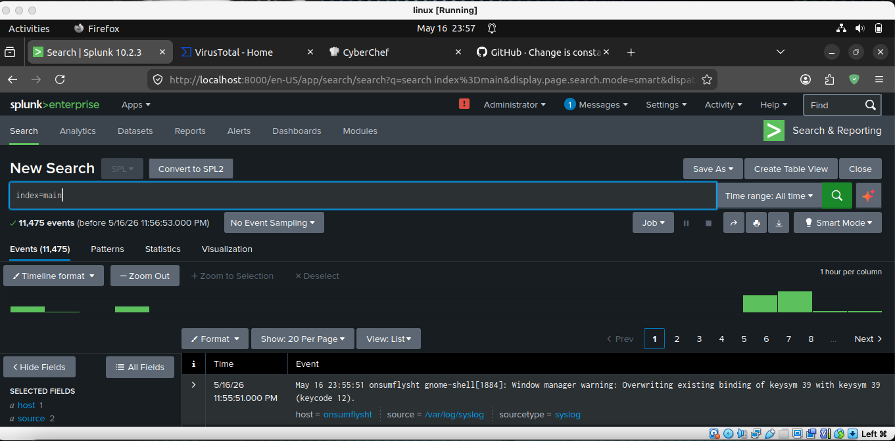
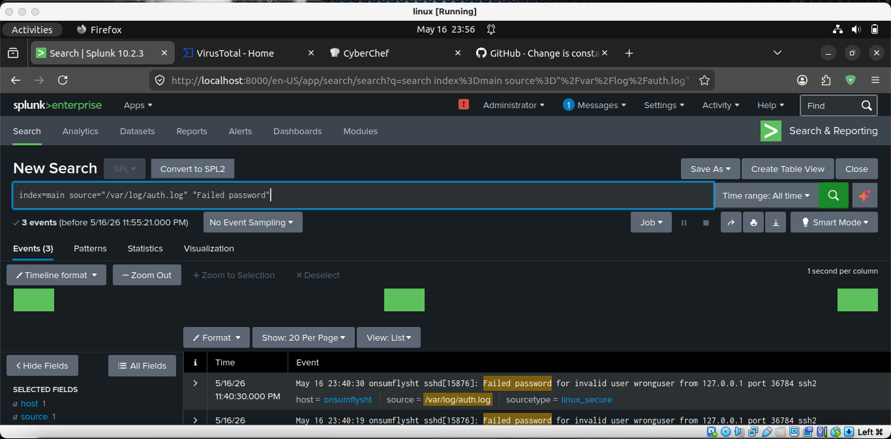
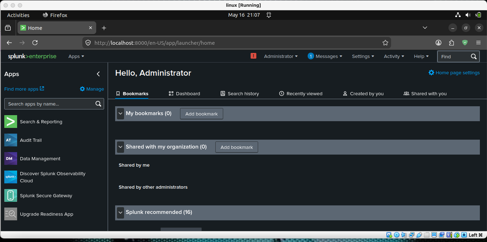

# 🛡️ Splunk SIEM Home Lab – Basic Log Ingestion & Threat Hunting

## 📌 Project Overview
Built a fully functional SIEM environment from scratch on Ubuntu Linux to move beyond guided labs and understand log pipelines end-to-end — from ingestion and indexing to real-time threat detection.

---

## 🏗️ 1. Architecture & Log Forwarding Configuration

<p align="center">
  
</p>
<p align="center"><em>Figure 1: Splunk Enterprise receiver configuration listening on TCP Port 9997.</em></p>

### 📄 Infrastructure Breakdown
* **SIEM Core:** Deployed **Splunk Enterprise 10.2.3** on Ubuntu Linux as the central indexer and search head.
* **Log Ingestion:** Configured a native receiving pipeline on **port 9997** to collect streamed endpoint data.
* **Telemetry Sources:** Shipped live system telemetry including `syslog` and `/var/log/auth.log` into a searchable index.

---

## 📥 2. Telemetry Ingestion & Volume Verification

<p align="center">
  
</p>
<p align="center"><em>Figure 2: Live event stream confirming active indexed system events across sourcetypes.</em></p>

### 📄 Ingestion Analysis
* **Live Telemetry:** Successfully indexed **11,475 real system events** (live host activity, not sample/pre-canned data).
* **Data Integrity:** Verified sourcetype parsing across system and authentication logs to ensure timestamps and host headers were correctly indexed.

---

## ⚡ 3. Attack Simulation & Threat Detection

<p align="center">
  
</p>
<p align="center"><em>Figure 3: Targeted SPL query isolating SSH brute-force patterns across authentication logs.</em></p>

### 📄 Detection Logic & Attack Scenario
* **Attack Simulation:** Executed an SSH brute-force attack against the host to generate realistic failed-login activity for detection validation.
* **SPL Query Construction:** Built real-time search queries targeting authentication failure signatures (`Failed password` / `invalid user`).

```spl
index=main sourcetype=syslog "Failed password" OR "invalid user"
| stats count by src_ip, user, host
| sort - count
```

---

## 📊 4. Enterprise SOC Dashboard & Monitoring

<p align="center">
  
</p>
<p align="center"><em>Figure 4: Single-pane-of-glass dashboard displaying real-time login activity and system metrics.</em></p>

### 📄 Operational Response
* **Real-Time Monitoring:** Consolidated log streams into visual widgets to detect abnormal activity spikes at a glance.
* **SOC Utility:** Streamlines triage by giving analysts immediate visibility into high-frequency failure events.

---

## 🎯 Conclusion & Key Takeaways

* **Pipeline Engineering:** Successfully established a real-time ingestion pipeline, moving from bare-metal log generation to centralized SIEM indexing over encrypted TCP channels.
* **Detection Efficacy:** Validated that native host logs (`auth.log` / `syslog`) combined with targeted SPL detection rules provide immediate operational visibility into brute-force and credential harvesting attempts.
* **SOC Readiness:** Built practical foundation in configuring log forwarders, writing detection queries, and creating dashboard panels for continuous security monitoring.
